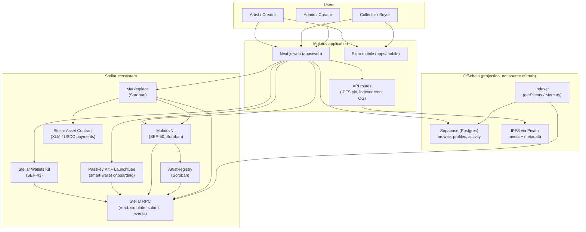
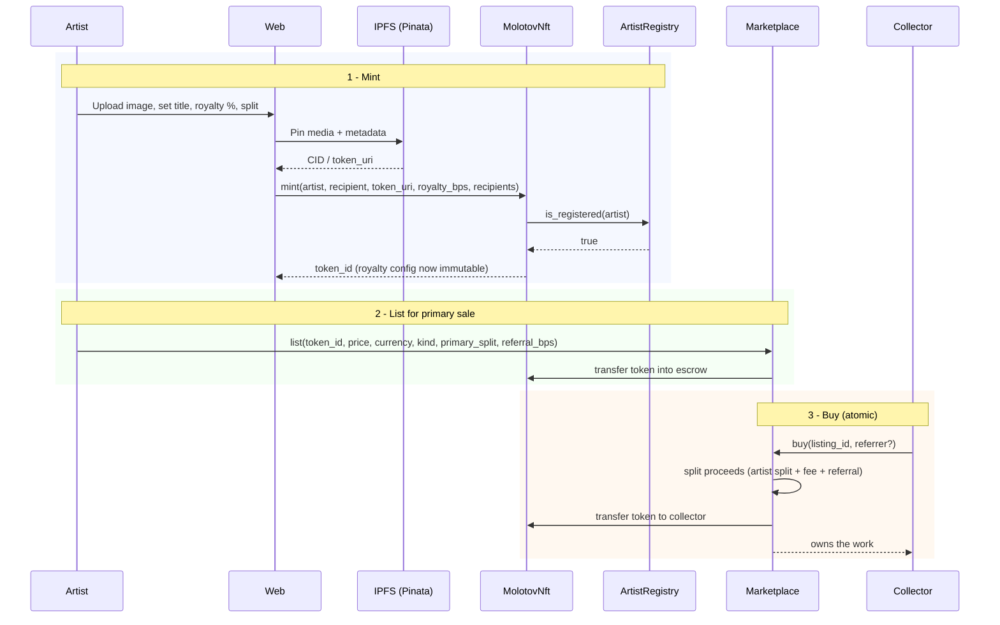
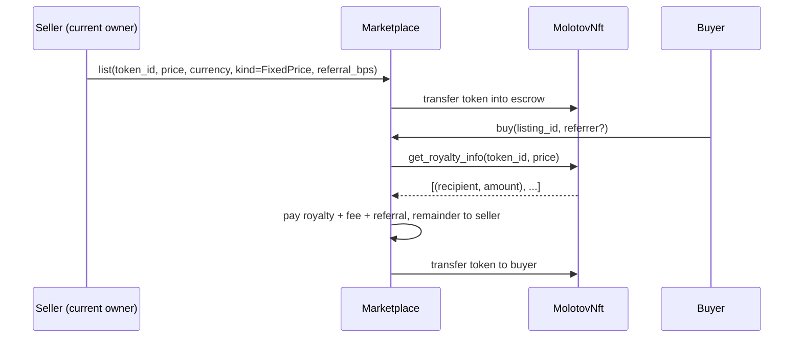
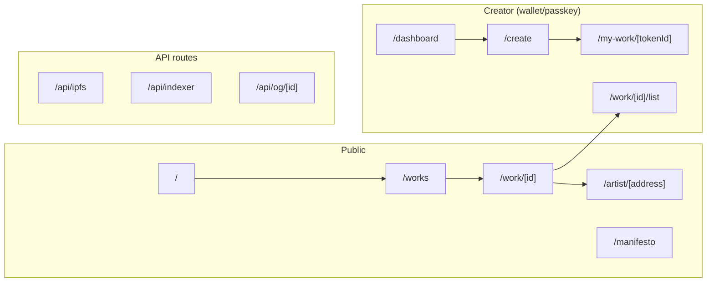
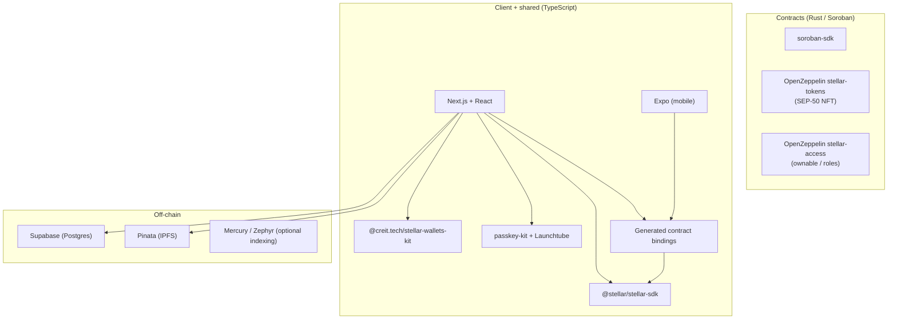
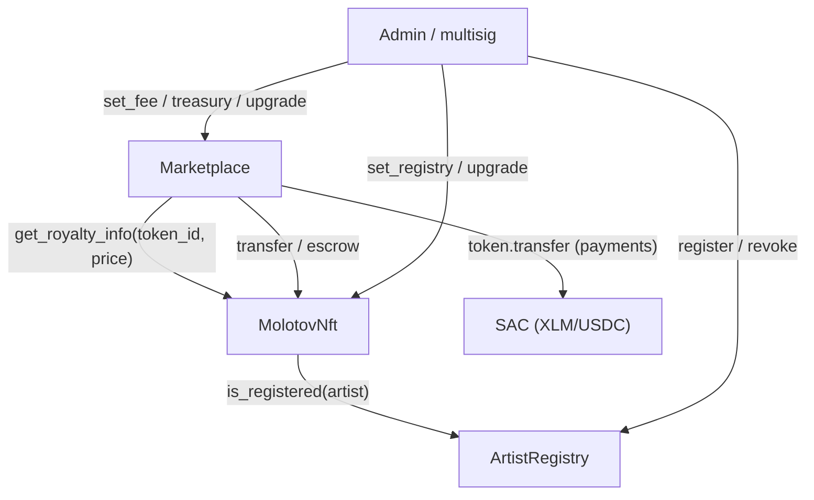
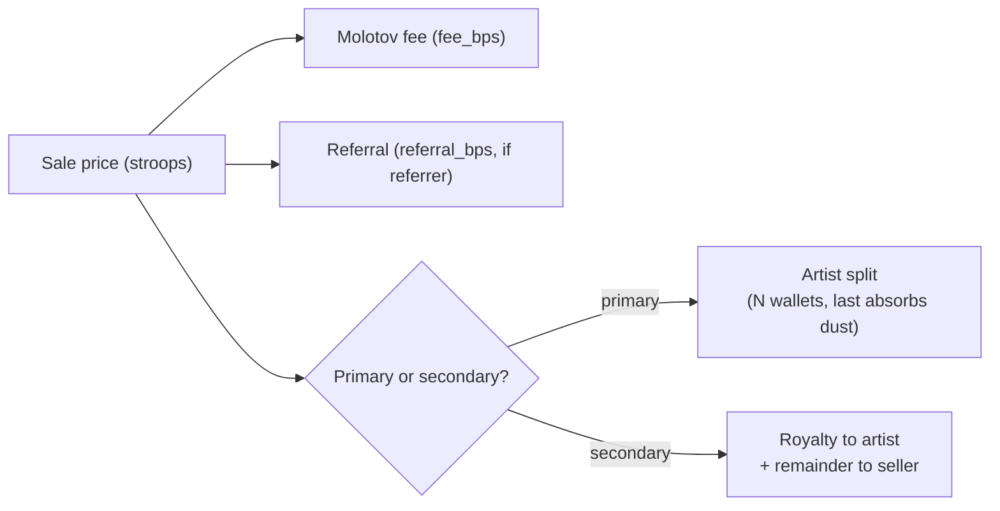
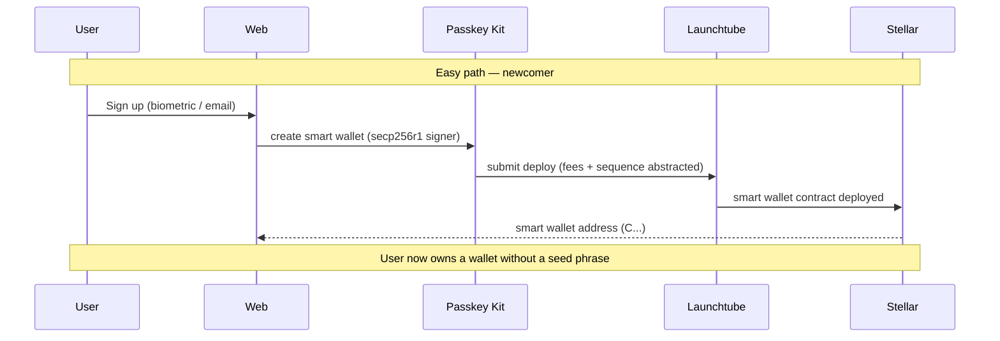
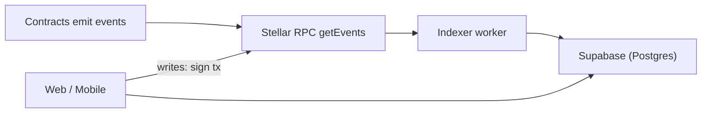

# MOLOTOV — Architecture Documentation

**An artist-first NFT marketplace, with royalties that actually follow the work.**

This document describes the Molotov application architecture: what it does, which
Stellar tools it uses, how the contracts and the off-chain layer fit together, and the
flows that connect them. Diagrams use [Mermaid](https://mermaid.js.org/) and render on
GitHub. The imperative, phase-by-phase build order lives in `doc/BUILD_PLAN.md`; this
document is the *what* and the *why*, written so a coding agent can map work directly
to files.

---

## 1. High-level system overview



Molotov is a web (and later mobile) app where artists mint their work as NFTs on
Stellar and sell it through a marketplace that enforces immutable royalties on every
resale. Three Soroban contracts hold the on-chain logic: `MolotovNft` (the token),
`ArtistRegistry` (the minting gate), and `Marketplace` (listings, sales, and the
atomic distribution of money). Media and metadata live on **IPFS** via Pinata. Browse,
profiles, and activity are served from **Supabase**, which is a projection rebuilt from
on-chain events — the chain is always the source of truth. Onboarding has two paths:
**Stellar Wallets Kit** for users who already have a wallet, and **Passkey Kit +
Launchtube** smart wallets for newcomers who sign up with a biometric/email and never
see a seed phrase.

---

## 2. What the application does

### 2.1 User roles

| Role | Main actions |
| --- | --- |
| **Artist / Creator** | Connect wallet or create a passkey smart wallet, get registered (gate), mint a work (image → IPFS → Soroban mint with immutable royalty + optional multi-wallet split), list it for primary sale, set the resale royalty. |
| **Collector / Buyer** | Browse, open a work, buy (atomic payment + NFT transfer), resell (secondary listing), transfer/gift, burn, share a work with a referral link. |
| **Admin / Curator** | Register/revoke artists in the gate, set the marketplace fee and treasury, hold (then hand off to multisig) the upgrade keys. |

### 2.2 Primary mint + sale flow



### 2.3 Secondary sale flow (resale with enforced royalty)



### 2.4 Application routes



| Route | Type | Description |
| --- | --- | --- |
| `/` | Public | Landing (hero, economy-flow, activity feed, manifesto). |
| `/works` | Public | Browse and filter works (reads Supabase). |
| `/work/[id]` | Public | Work page: buy, share (referral link), transfer, burn, provenance. |
| `/artist/[address]` | Public | Artist profile: About · Created · Owned · Collections · Activity. |
| `/manifesto` | Public | Editorial manifesto page. |
| `/create` | Creator | Mint flow: upload → IPFS → royalty/split → sign mint. |
| `/my-work/[tokenId]` | Creator | Certificate page with on-chain + IPFS metadata. |
| `/work/[id]/list` | Creator | List for primary or secondary sale (price, currency, split, referral). |
| `/dashboard` | Creator | Creator dashboard (works, listings, activity). |
| `/api/ipfs` | API | Server-side Pinata pinning (keeps the JWT off the client). |
| `/api/indexer` | API | Cron/worker that ingests on-chain events into Supabase. |
| `/api/og/[id]` | API | Open Graph images for shared work links. |

---

## 3. Tech stack



| Layer | Technology | Notes |
| --- | --- | --- |
| **Contracts** | Rust + [`soroban-sdk`](https://crates.io/crates/soroban-sdk) | Three contracts in a Cargo workspace under `contracts/`. |
| **NFT standard** | [OpenZeppelin Stellar Contracts](https://github.com/OpenZeppelin/stellar-contracts) — `stellar-tokens` (SEP-50), `stellar-access` (ownable/roles) | Audited base; SEP-50 NFT + SEP-49 upgradeability. |
| **Web** | [Next.js](https://nextjs.org) + React + Tailwind | `apps/web`. PWA, i18n ES/EN. |
| **Mobile** | [Expo](https://expo.dev) | `apps/mobile`, later phase. Reuses shared packages. |
| **Stellar SDK** | [`@stellar/stellar-sdk`](https://github.com/stellar/js-stellar-sdk) | Build/sign/submit, RPC reads, simulation. |
| **Wallets** | [Stellar Wallets Kit](https://stellarwalletskit.dev/) (SEP-43) | Freighter, xBull, Albedo, LOBSTR, Hana, etc. |
| **Smart-wallet onboarding** | [Passkey Kit](https://github.com/kalepail/passkey-kit) + [Launchtube](https://developers.stellar.org/docs/build/apps/smart-wallets) | Biometric/email sign-up, fee-abstracted submission. |
| **Payments** | [Stellar Asset Contract](https://developers.stellar.org/docs/tokens/stellar-asset-contract) (XLM, later USDC) | Marketplace settles in a SAC token. |
| **Media** | [Pinata](https://pinata.cloud) (IPFS) | Pinned via a server API route. |
| **Off-chain DB** | [Supabase](https://supabase.com) (Postgres) | Projection of on-chain state for browse/profiles. |
| **Indexing** | Stellar RPC `getEvents`, or [Mercury/Zephyr](https://www.mercurydata.app) | Custom poller v1; managed Mercury as an option. |
| **CLI / bindings** | [Stellar CLI](https://developers.stellar.org/docs/tools/cli) | `stellar contract build / deploy / bindings typescript`. |

---

## 4. Project structure

```
molotov/
├── apps/
│   ├── web/                       # Next.js app
│   │   ├── app/
│   │   │   ├── page.tsx           # Landing
│   │   │   ├── works/             # Browse (reads Supabase)
│   │   │   ├── work/[id]/         # Work page + list/ subroute
│   │   │   ├── artist/[address]/  # Artist profile (tabs)
│   │   │   ├── create/            # Mint flow
│   │   │   ├── my-work/[tokenId]/ # Certificate
│   │   │   ├── dashboard/         # Creator dashboard
│   │   │   └── api/
│   │   │       ├── ipfs/          # Pinata pin (server-side JWT)
│   │   │       ├── indexer/       # Event ingestion cron
│   │   │       └── og/[id]/       # Share/OG images
│   │   ├── components/            # UI (work cards, mint form, share, etc.)
│   │   ├── hooks/                 # use-wallet, use-passkey, use-i18n
│   │   ├── lib/
│   │   │   ├── stellar/           # network config, RPC client, contract IDs
│   │   │   ├── wallet/            # Wallets Kit + Passkey Kit wiring
│   │   │   ├── ipfs.ts            # Pinata helpers
│   │   │   └── supabase/          # browser/server/service clients
│   │   ├── providers/             # wallet-provider, i18n-provider
│   │   ├── public/                # PWA icons, manifests
│   │   └── scripts/               # generate-pwa-icons, etc.
│   └── mobile/                    # Expo app (later phase)
│
├── contracts/                     # Rust workspace
│   ├── Cargo.toml                 # Workspace
│   ├── nft/                       # MolotovNft (SEP-50)
│   │   ├── src/lib.rs
│   │   └── src/test.rs
│   ├── artist-registry/           # ArtistRegistry (gate)
│   │   ├── src/lib.rs
│   │   └── src/test.rs
│   └── marketplace/               # Marketplace (listings, sales, splits)
│       ├── src/lib.rs
│       └── src/test.rs
│
├── packages/
│   ├── stellar-client/            # Generated bindings + typed client wrappers
│   ├── types/                     # Shared TS types (derived from bindings)
│   └── ui/                        # Shared UI primitives
│
├── supabase/                      # Migrations + schema (projection tables)
│
├── doc/
│   ├── architecture.md            # This file
│   ├── BUILD_PLAN.md              # Phase-by-phase execution order
│   ├── adr/                       # Architecture decision records
│   └── branding/                  # Brand assets, tokens
│
└── turbo.json / pnpm-workspace.yaml
```

---

## 5. The contracts



### 5.1 MolotovNft (SEP-50)

Non-fungible token on the OpenZeppelin SEP-50 base. `transfer`, `burn`, `owner_of`,
`balance` come from the base; `token_uri` is overridden to serve per-token IPFS URIs.
Royalty config is written at mint and is **immutable** forever (no setters; the
standard royalty stubs panic).

| Function | Role |
| --- | --- |
| `__constructor(admin, registry, name, symbol)` | Init; `admin` is owner for upgrades only. |
| `mint(artist, recipient, token_uri, royalty_bps, recipients)` | Gated + validated mint; persists URI and immutable royalty config. |
| `get_royalty_info(token_id, sale_price) -> Vec<(Address, i128)>` | Royalty distribution for a sale; consumed by the Marketplace. |
| `royalty_bps(token_id)`, `registry()` | Reads. |
| `set_registry(new)` | Owner-gated; lets the gate be activated/rotated without redeploy. |
| `upgrade(new_wasm_hash)` | Owner-gated (SEP-49 pattern). |
| `set_default_royalty` / `set_token_royalty` | Stubs that always panic (immutability guard). |

Constants: `MIN_ROYALTY_BPS = 100` (1%), `MAX_ROYALTY_BPS = 1500` (15%),
`MAX_RECIPIENTS = 10`. Editions are modeled as N distinct tokens sharing one URI.
Event: `MintedEvent { token_id (topic), artist, recipient, royalty_bps, recipients_count }`.

### 5.2 ArtistRegistry

The minting gate. Admin-curated (not self-registration).

| Function | Role |
| --- | --- |
| `__constructor(admin)` | Set owner. |
| `register(artist)` / `revoke(artist)` | Admin-gated; emit events. |
| `is_registered(artist) -> bool` | Exact signature the NFT calls cross-contract. |
| `upgrade(new_wasm_hash)` | Owner-gated. |

### 5.3 Marketplace

Listings, sales, and atomic money distribution. **Escrow** model: the NFT moves into
the contract on listing. Settles in a SAC token from an allowlist.

| Function | Role |
| --- | --- |
| `__constructor(admin, fee_bps, treasury)` | Platform fee + treasury. |
| `list(seller, nft, token_id, price, currency, kind, editions, primary_split, referral_bps) -> u64` | Create listing; escrow token(s); validate currency against allowlist. |
| `buy(buyer, listing_id, referrer)` | Atomic purchase + distribution (see §6). |
| `cancel(seller, listing_id)` | Return escrowed token(s). |
| `set_allowed_currency(currency, allowed)` | Admin allowlist of payment SACs. |
| `set_fee` / `set_treasury` / `upgrade` | Admin/owner-gated. |

`ListingKind = FixedPrice | OpenEdition | Auction`. `Auction` is defined now but its
logic panics `NotImplemented`, enabled later via upgrade. Events `ListingCreated`,
`Sold`, `ListingCancelled` are designed so the indexer can reconstruct full state
(price, currency, buyer, seller, royalty/referral/fee paid).

---

## 6. Royalty and split model

Two distinct splits, not to be conflated:

| | Trigger | Distribution |
| --- | --- | --- |
| **Primary split** | First sale (`primary_split = Some(...)`) | Proceeds split per the artist's chosen wallets (cap 10), minus fee, minus referral. Enables open-call / NGO fundraising. |
| **Secondary royalty** | Resale (`primary_split = None`) | Royalty paid to the artist via `get_royalty_info`, minus fee, minus referral; remainder to a single seller wallet (v1). |



Royalty math: `total = sale_price * total_bps / 10000`; each share is
`total * share_bps / 10000`; the **last recipient absorbs rounding dust** so the sum
closes exactly. All amounts are stroops (`i128`, 1 XLM = 10⁷). Arithmetic uses
`checked_*` everywhere.

**Royalty scope (deliberate):** royalties are honored when a sale goes through
Molotov's marketplace. A raw `transfer` evades them; forcing payment inside `transfer`
would break composability. This is the accepted industry standard, stated openly.

---

## 7. Sale types

| Type | Model | v1 |
| --- | --- | --- |
| One-of-one (1/1) | One token, fixed-price listing. | Yes |
| Open Edition (OE) | N tokens, same URI; time window (`ends_at`). Artist pre-mints N; sold from inventory. | Yes (pre-mint) |
| Collection | Off-chain grouping (Supabase metadata referencing the artist's tokens). | Yes (off-chain) |
| Auction | `Auction` enum variant; logic via upgrade. | Structure yes, logic later |

---

## 8. Onboarding and wallets

**Identity model — wallet-first.** Molotov has no email/password accounts: there is
no server-side auth, no password to store, no session to forge. Identity *is* the
Stellar address, so "log in" means "connect a wallet" — this path is already built
(Stellar Wallets Kit, §8). Easy passkey sign-up that mints an invisible smart wallet
for newcomers (Passkey Kit + Launchtube) is **planned**, not yet built; until then,
onboarding assumes the user already has a wallet.

Two paths, because the audience splits between crypto-native artists and newcomers
arriving from social media.



- **Power users:** [Stellar Wallets Kit](https://stellarwalletskit.dev/) (SEP-43) — one
  interface across Freighter, xBull, Albedo, LOBSTR, Hana, and more. The app passes an
  unsigned XDR and receives a signed XDR; the private key never enters the app.
- **Newcomers:** [Passkey Kit](https://github.com/kalepail/passkey-kit) creates a
  Soroban smart wallet keyed by a passkey (WebAuthn / secp256r1, Protocol 21+).
  [Launchtube](https://developers.stellar.org/docs/build/apps/smart-wallets) submits the
  transactions with fees and sequence numbers abstracted away. This is the bridge for
  the "saw it on social → tap → make an account in seconds → collect" flow.

Smart-wallet signer/address lookups can use the same Mercury/Zephyr indexing the
marketplace uses (§9), avoiding a second data dependency.

---

## 9. Off-chain data: indexer and Supabase

The chain is the source of truth; **Supabase is a reconstructible projection**. Browse,
profiles, and the activity feed read Supabase, never the chain per request.



- **Indexer:** a worker (cron route in `apps/web` or a small service) polls
  `getEvents` for the three contract IDs and upserts idempotently, keyed by
  `(ledger, tx_hash, event_index)`. Hydrates `token_uri`/CID from the event or by
  calling the contract. As a managed alternative, a
  [Mercury/Zephyr](https://www.mercurydata.app) program can ingest the events instead
  of a hand-rolled poller.
- Because events feed the projection, contract events are designed in full now —
  changing a stored value or an event shape is the expensive change; adding a function
  via upgrade is cheap.

### 9.1 Data responsibility split

| Store | Owns | Source of truth for |
| --- | --- | --- |
| **Stellar** | NFT ownership, royalty config, listings, sales, balances | Funds, on-chain state, provenance |
| **Supabase** | Indexed projections, collections grouping, profile metadata, activity | Fast browse/filter, profiles, feed — all rebuildable from chain |
| **IPFS (Pinata)** | Media files + metadata JSON | The artwork bytes and its metadata |

### 9.2 Projection schema (sketch)

| Table | Key columns |
| --- | --- |
| `artists` | `address`, `handle`, `bio`, `links`, `registered` |
| `tokens` | `token_id`, `artist`, `owner`, `ipfs_cid`, `royalty_config`, `minted_at` |
| `listings` | `listing_id`, `token_id`, `seller`, `price`, `currency`, `kind`, `status` |
| `sales` | `tx_hash`, `token_id`, `buyer`, `seller`, `price`, `royalty_paid`, `referral_paid`, `fee_paid` |
| `collections` | `id`, `artist`, `title`, `token_ids[]` (off-chain grouping) |
| `referrals` | `referrer`, `token_id`, `tx_hash`, `amount` |

---

## 10. Sharing and referrals

Sharing is the growth engine, and the referral is on-chain. A share link deep-links to
the work with the referrer's address: `/work/[id]?ref=<address>`. When a buy carries a
`referrer`, the marketplace pays `referral_bps` to that address at sale time. Social
traffic lands directly on the work (not the landing), which serves the
"social → work → easy sign-up → collect" path. Open Graph images are generated at
`/api/og/[id]` so shared links preview well.

---

## 11. Fiat on-ramp (future)

Ana's "pay with card / price in USD" maps to Stellar **anchors** via
[SEP-24](https://github.com/stellar/stellar-protocol/blob/master/ecosystem/sep-0024.md)
(interactive deposit/withdraw) with SEP-10 auth and SEP-12 KYC, and/or
[MoneyGram Stellar ramps](https://developer.moneygram.com/moneygram-developer/docs/access-to-moneygram-ramps).
USD pricing can start as display-only (convert XLM↔USD for the UI) and later settle in
a USDC SAC. This is a later phase; it does not block the on-chain MVP and lives in API
routes so provider keys stay server-side.

---

## 12. Security model

Soroban removes some bug classes by design (no `delegatecall`, no classic
cross-contract reentrancy, explicit authorization). What the system guards:

- **Authorization** on every privileged function (`require_auth`, owner/admin).
- **Royalty immutability:** no setters; standard stubs panic.
- **Bounded loops:** `MAX_RECIPIENTS = 10` (an unbounded loop over a user-controlled
  list is a DoS/gas vector).
- **Currency allowlist:** the marketplace never calls an arbitrary token/SAC.
- **Checks-effects-interactions:** listing state updated before transfers.
- **No fund custody:** the marketplace orchestrates buyer→recipient transfers; it never
  holds funds.
- **Client-side signing:** keys never reach a server; transactions are simulated before
  submission.

Pre-mainnet: static analysis with [Scout](https://github.com/CoinFabrik/scout-soroban)
and the [OpenZeppelin Soroban detectors](https://github.com/OpenZeppelin/soroban-security-detectors-sdk),
then a third-party audit (via the [Stellar Audit Bank](https://stellar.org/grants-and-funding/soroban-audit-bank)
where eligible). A contract that moves money does not ship to mainnet without this.

### Security checklist

- [ ] Every privileged path requires the right auth.
- [ ] Initialization/registry rotation cannot be hijacked.
- [ ] All arithmetic is checked; recipients capped at 10.
- [ ] Payment currency is allowlisted.
- [ ] Events cover every state transition the indexer needs.
- [ ] Royalty config is provably immutable post-mint.
- [ ] Upgrade keys move to multisig/timelock before mainnet.

---

## 13. Governance and upgrades

Contracts are **upgradeable in place** (`update_current_contract_wasm`, owner-gated):
same address, same data, new code. The cost is governance — whoever holds the key can
change the rules. Before mainnet, the `upgrade`/`admin` keys for all three contracts
move to a **multisig or timelock**, stated openly. The per-token royalty stays
immutable regardless of code changes (no path rewrites it).

---

## 14. Testing strategy

| Tier | What it covers |
| --- | --- |
| **Unit (Rust)** | Royalty validation, recipient cap, split + dust math, auth on privileged fns, immutability, the gate. |
| **Integration (testnet)** | Mint with gate, register/revoke, primary/secondary list+buy with correct distribution, referral, fee, cancel, OE sell-through. |
| **Negative** | Missing auth, currency outside allowlist, 11 recipients, `Auction` panics. |
| **Quality** | `cargo-mutants` to verify tests catch mutations; Scout in CI; testnet smoke before any mainnet step. |

---

## 15. Environment variables

| Variable | Scope | Description |
| --- | --- | --- |
| `NEXT_PUBLIC_STELLAR_NETWORK` | Public | `testnet` or `mainnet`. |
| `NEXT_PUBLIC_RPC_URL` | Public | Stellar RPC endpoint. |
| `NEXT_PUBLIC_NFT_CONTRACT_ID` | Public | MolotovNft contract ID. |
| `NEXT_PUBLIC_REGISTRY_CONTRACT_ID` | Public | ArtistRegistry contract ID. |
| `NEXT_PUBLIC_MARKETPLACE_CONTRACT_ID` | Public | Marketplace contract ID. |
| `NEXT_PUBLIC_PAYMENT_SAC` | Public | Payment SAC (XLM, later USDC). |
| `PINATA_JWT` | Server | Pinata JWT for IPFS pinning. |
| `NEXT_PUBLIC_SUPABASE_URL` | Public | Supabase project URL. |
| `NEXT_PUBLIC_SUPABASE_ANON_KEY` | Public | Supabase anon key. |
| `SUPABASE_SERVICE_ROLE_KEY` | Server | Indexer writes to projection tables. |
| `LAUNCHTUBE_URL` | Public | Launchtube endpoint (passkey submission). |
| `LAUNCHTUBE_JWT` | Server | Launchtube token. |
| `MERCURY_URL` / `MERCURY_JWT` | Public/Server | Optional Mercury/Zephyr indexing. |

---

## 16. Delivery plan

Imperative, phase-by-phase detail in `doc/BUILD_PLAN.md`. In short: fix and redeploy
the NFT (recipient cap, `upgrade`, `set_registry`) → ArtistRegistry + activate the gate
→ Marketplace (fixed-price + open edition, atomic buy, primary split, secondary
royalty, referral, `Auction` reserved) → bindings → indexer + Supabase → web (browse,
work page, profiles, listing, passkey onboarding, sharing) → mobile. Off-chain phases
can start in parallel once bindings exist. Governance to multisig before mainnet.

---

## 17. Open questions and known risks

| Area | Question / risk |
| --- | --- |
| OE mint | Pre-mint (v1) vs lazy-mint (upgrade) and its mint-delegation model. |
| Currency | When/how USDC SAC is added alongside XLM. |
| Smart wallets | Launchtube is a prototype service with no SLA; plan a fallback signing path. |
| Indexing | Hand-rolled `getEvents` poller vs managed Mercury/Zephyr. |
| Fiat | Anchor (SEP-24) / MoneyGram integration scope and KYC. |
| Resale split | Multi-wallet split on resale deferred to a later phase. |
| AI discovery | Recommendation feed (incl. anti-echo-chamber) is off-chain, depends on the indexer; later. |

---

## 18. Glossary

- **SEP-50:** the standard NFT interface on Soroban (OpenZeppelin base).
- **SEP-49:** the upgradeable-contract standard pattern.
- **SEP-43:** the wallet interface implemented by Stellar Wallets Kit.
- **SAC:** Stellar Asset Contract — lets XLM and classic assets be used inside Soroban.
- **Smart wallet / passkey:** a Soroban contract account signed with a WebAuthn passkey
  (secp256r1), created via Passkey Kit and submitted via Launchtube.
- **bps:** basis points; 10000 bps = 100%.
- **stroop:** the smallest unit of XLM; 1 XLM = 10⁷ stroops.
- **Gate:** restriction of minting to registered artists, via `is_registered`.
- **Projection:** the off-chain Supabase view rebuilt from on-chain events; the chain
  remains the source of truth.

---

## 19. References

- [Stellar Developers](https://developers.stellar.org) — network, RPC, Soroban, SEPs
- [soroban-sdk](https://crates.io/crates/soroban-sdk) — Rust contract SDK
- [OpenZeppelin Stellar Contracts](https://github.com/OpenZeppelin/stellar-contracts) — SEP-50 / SEP-49 base
- [Stellar Wallets Kit](https://stellarwalletskit.dev/) — wallet connection (SEP-43)
- [Passkey Kit](https://github.com/kalepail/passkey-kit) and [Smart Wallets docs](https://developers.stellar.org/docs/build/apps/smart-wallets) — passkey smart wallets + Launchtube
- [Stellar Asset Contract](https://developers.stellar.org/docs/tokens/stellar-asset-contract) — payments inside Soroban
- [Stellar CLI](https://developers.stellar.org/docs/tools/cli) — build, deploy, bindings
- [Scout (CoinFabrik)](https://github.com/CoinFabrik/scout-soroban) and [OpenZeppelin Soroban detectors](https://github.com/OpenZeppelin/soroban-security-detectors-sdk) — static analysis
- [Stellar Audit Bank](https://stellar.org/grants-and-funding/soroban-audit-bank) — audit funding
- [Mercury / Zephyr](https://www.mercurydata.app) — managed indexing
- [SEP-24](https://github.com/stellar/stellar-protocol/blob/master/ecosystem/sep-0024.md) — interactive anchor deposit/withdraw (fiat ramps)
- [Pinata](https://pinata.cloud) — IPFS pinning
- [Supabase](https://supabase.com) — auth and Postgres
